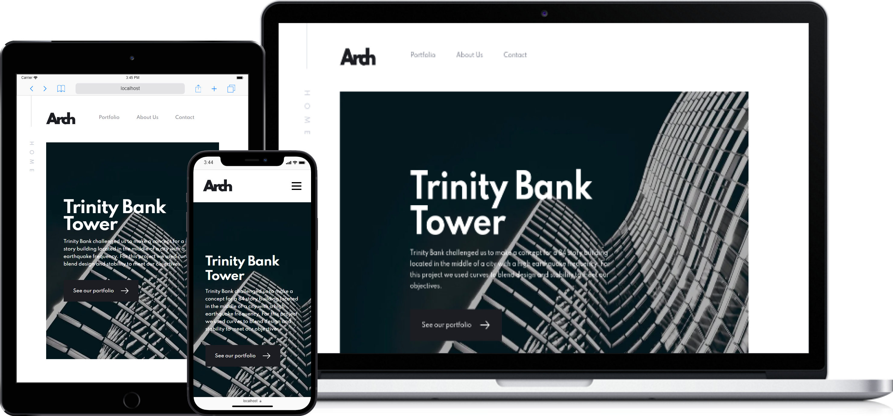

<div style="display: flex; justify-content: center; margin-bottom: 80px">
  
</div>

# About

Arch Studio is a website developed for a ficticious architecture agency. The concept and design is from Frontend Mentor, all the development was planned and done by myself.

The purpose of the project was not only to train skills and the use of the used stack, but to define a blueprint for future projects, because of this, it carries a lot of concepts, technologies and a complete Wiki with instructions and overviews.

For more, check the available [Wiki](https://github.com/leonardonegrao/arch-studio/wiki) of the project (available in brazilian portuguese and english).

A live version is available [here](https://arch-studio-blush.vercel.app/), thanks to Vercel.

<div style="display: flex; justify-content: center; margin: 80px 0;">
  
</div>

# 💻 Get Started

The requirements to run this applications locally are:

- Node.js and npm (Node's v14 LTS is recommended)
- Recent version of Chrome, Firefox or a Chromium-based browser (as this application was not intended to work in most browsers)
- Yarn is recommended

Once the repository was downloaded or cloned, you need to install dependencies:

```bash
npm install
# or
yarn
```

```bash
npm run dev
# or
yarn dev
```

# 🤝 Tech Stack & Acknowledgements

This project was made with:

- React.js
- Next.js
- TypeScript
- Styled Components
- Framer Motion
- GraphQL
- DatoCMS
- ESLint
- Husky
- Vercel
- Lottie
- Commitlint
- ☕ + 🎧

And a special thanks to [Frontend Mentor](https://www.frontendmentor.io/solutions), for offering the design and assets 🙏.
